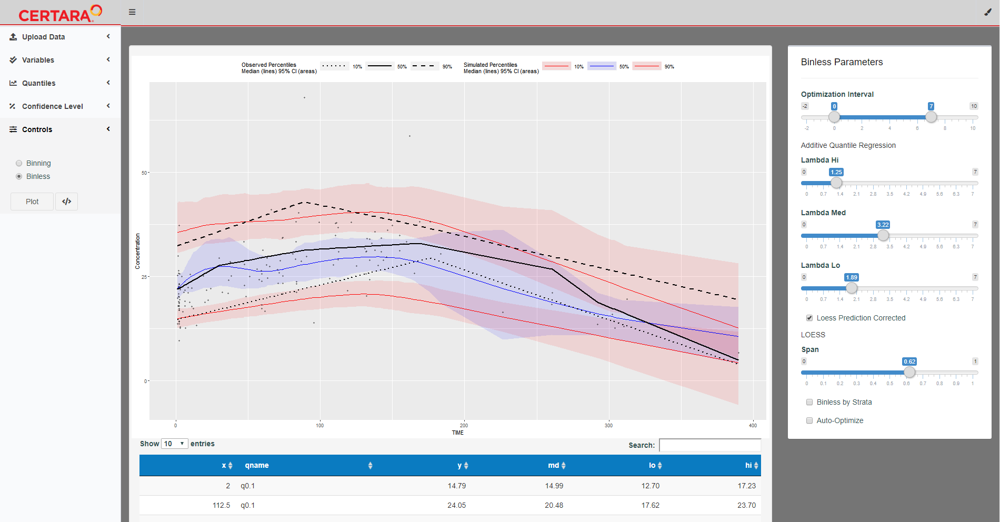
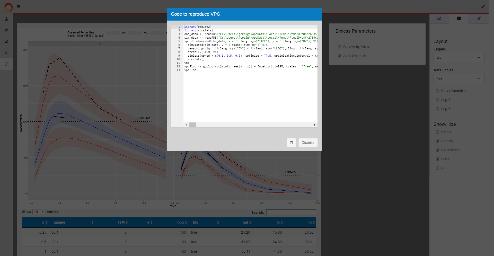

shiny-vpc
========

# Shiny App for Visual Predictive Check (VPC)

This repo contains a Shiny application to derive VPCs and pcVPCs using traditional binning methods and advanced regression techniques (binless methods).
The application utilizes the `tidyvpc` package developed by our team of pharmacometricians and software engineers at Certara.


## Features

* **Binning Methods:** Binning methods include x-variable, pam, kmeans, quantiles, centers, breaks, and more. 
* **Binless Methods(Advanced Regression Techniques):** Additive Quantile Regression to generate VPC and LOESS pcVPC.
* **Binning/Binless by Strata:** Specify binning and binless parameters for each level of stratification.
* **Plot Customization:** Use `ggplot2` to specify plot facetting, color aesthetics, line types, and more.
* **Code Generation:** Generate `vpcstats` and `ggplot2` code to reproduce VPC in your local R Session.




## Installation and Running information

``` r
# Install the development version of tidyvpc from GitHub:
install.packages("devtools")
library(devtools)
devtools::install_github("jameswcraig/tidyvpc")
# Install CRAN Dependencies:
install.packages(c("backports", "DT", "ggplot2", "rlang", "shinyAce",
  "shinydashboard", "shinydashboardPlus", "shinyjs",
  "shinycssloaders", "shinyWidgets"))
# Install shinyMeta by Rstudio for code generation:
library(remotes)
remotes::install_github("rstudio/shinymeta")
# Run Shiny App for Visual Predictive Check (VPC)
shiny::runGitHub("shiny-vpc", "jameswcraig")


```

## File Layout

The Shiny application requires 2 separate file uploads which can be in csv, fit, or RDS format:

1.) obs_data: Observed data with the following columns:

* **Required:** *TIME, DV*
* **Optional:** *PRED, LLOQ, Stratification Variables*

2.) sim_data: Simulated data with the following columns:

* **Required:** *TIME, DV, REP*
* **Optional:** *PRED, LLOQ, Stratification Variables*

**Notes:** Please subset MDV = 0 in data before uploading and make sure there are no missing rows. Variable names do not need to match the names above but at a minimum your data will need to contain a y-variable (typically named DV) and x-variable (typically TIME) to derive VPC.


## Example Code Generation

``` r
library(vpcstats)
library(ggplot2)

vpc <- observed(obs_data, x = !!rlang::sym("TIME"), y = !!rlang::sym("DV")) %>%
  simulated(sim_data, y = !!rlang::sym("DV")) %>%
  censoring(blq = !!rlang::sym("DV") < !!rlang::sym("LLOQ"), lloq = !!rlang::sym("LLOQ")) %>%
  stratify(~ISM) %>%
  binless(qpred = c(0.1, 0.5, 0.9), optimize = TRUE, optimization.interval = c(0L, 7L), conf.level = 0.95) %>%
  vpcstats()

vpcPlot <- ggplot(vpc$stats, aes(x = x)) + 
	facet_grid(~ISM, scales = "free", as.table = FALSE) + 
	geom_ribbon(aes(ymin = lo, ymax = hi, fill = qname, col = qname, group = qname), alpha = 0.1, col = NA) + 
	geom_line(aes(y = md, col = qname, group = qname)) + geom_line(aes(y = y, linetype = qname), size = 1) + 
	geom_hline(data = unique(vpc$data[, .(LLOQ), by = eval("ISM")]), aes(yintercept = !!as.symbol("LLOQ")), linetype = "dotted", size = 1) + 
	geom_text(data = unique(vpc$data[, .(LLOQ), by = eval("ISM")]), aes(x = 10, y = LLOQ, label = paste("LLOQ", LLOQ, sep = "="), ), vjust = -1) + 
	scale_colour_manual(name = "Simulated Percentiles\nMedian (lines) 95% CI (areas)", breaks = c("q0.1", "q0.5", "q0.9"), values = c("red", "blue", "red"), labels = c("10%", "50%", "90%")) + 
	scale_fill_manual(name = "Simulated Percentiles\nMedian (lines) 95% CI (areas)", breaks = c("q0.1", "q0.5", "q0.9"), values = c("red", "blue", "red"), labels = c("10%", "50%", "90%")) + 
	scale_linetype_manual(name = "Observed Percentiles\nMedian (lines) 95% CI (areas)", breaks = c("q0.1", "q0.5", "q0.9"), values = c("dotted", "solid", "dashed"), labels = c("10%", "50%", "90%")) + 
	guides(fill = guide_legend(order = 2), colour = guide_legend(order = 2), linetype = guide_legend(order = 1)) + 
	theme(legend.position = "top", legend.key.width = grid::unit(2, "cm")) + 
	labs(x = "TIME", y = "Concentration")
```


